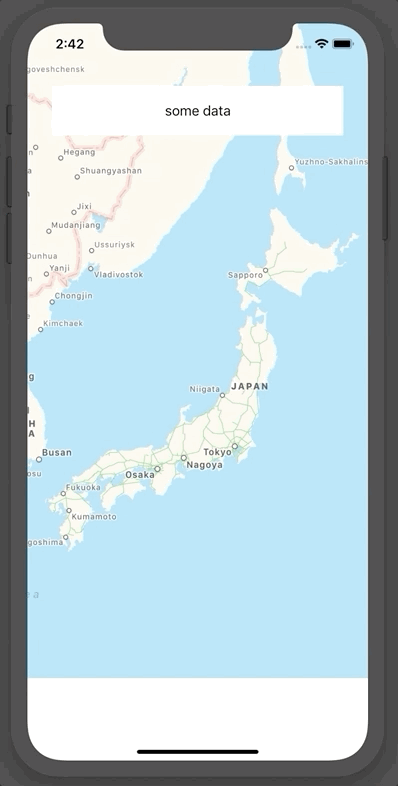

Sample project on how to use `UIViewPropertyAnimator` to create a transition animation between 2 views. Made to answer [this StackOverflow question](https://stackoverflow.com/questions/40755056/how-to-display-uitableviewcontroller-as-a-swipe-up-gesture-in-front-of-another-v).

